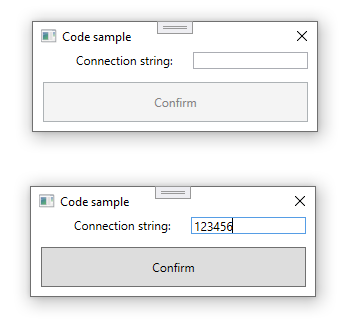

# About

Simple example for `CanExecute` which enables a button, in this case when a `TextBox` is not empty and has several characters. The code has been kept simple rather than fully implemented for easier learning of code paths and logic.

# :warning: Important

Code presented does not fully adhere to what a purest/seasoned developer would code, the intent is to provide a view point to how to work with a model, not being dependent on named controls but instead a model and commands.





:small_blue_diamond: **TextBox**

```xml
<TextBox
    Grid.Row="0"
    Grid.Column="1"
    Margin="10,0,25,0"
    Text="{Binding Path=ConnectionString, UpdateSourceTrigger=PropertyChanged}" />
```

:small_blue_diamond: **Button**

```xml
<Button
    Grid.Row="1"
    Grid.Column="0"
    Grid.ColumnSpan="2"
    Margin="10,13,25,32"
    Command="{Binding ConfirmCommand}"
    Content="Confirm" />
```

The model, `MainViewModel` 

:small_blue_diamond: **Code to execute with the button enabled**

```csharp
private void Confirm(object parameter)
{
    Debug.WriteLine($"Text for ConnectionString is '{ConnectionString}'");
}
```

:small_blue_diamond: **Code to control enable/disable of the button.**

```csharp
private bool CanConfirm(object parameter) 
    => IsValidConnection();

/// <summary>
/// Here is just enough code to demonstrate doing starter validation which
/// needs a good deal more to validate a connection string.
/// </summary>
/// <returns></returns>
private bool IsValidConnection()
{
    return !string.IsNullOrWhiteSpace(_connectionString) && _connectionString.Length > 5;
}
```

:small_blue_diamond: **Setup**

```csharp
public ICommand ConfirmCommand { get; }
public MainViewModel() => ConfirmCommand = new RelayCommand(Confirm, CanConfirm);
```


