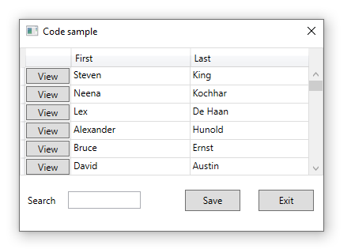

# About

In this part of the series save changes for edits and deleting have been added. From here the next step is to go with [MVVM pattern](https://en.wikipedia.org/wiki/Model%E2%80%93view%E2%80%93viewmodel). When transitioning to MVVM the entire data operations will change from what is here currently.

With that this is the last version that even resembles Windows Forms.

# See also
[WPF Apps With The Model-View-ViewModel Design Pattern](https://docs.microsoft.com/en-us/archive/msdn-magazine/2009/february/patterns-wpf-apps-with-the-model-view-viewmodel-design-pattern)

# Steps to run

- Run script.sql from SSMS (SQL-Server Management Studio) or insides of Visual Studio.
- Restored NuGet packages from Solution Explorer
- Build and run the project. 

[Microsoft TechNet article](https://social.technet.microsoft.com/wiki/contents/articles/53914.wpfentity-framework-core-primer-c.aspx)

