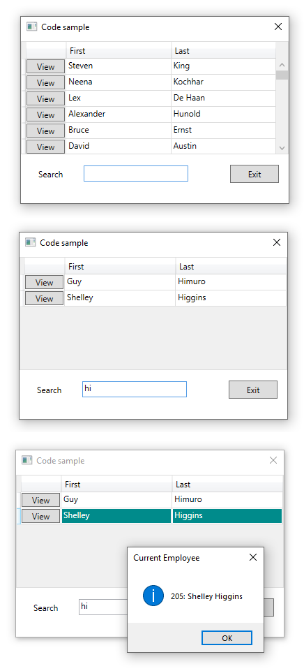

# About

Simple example for loading a DataGrid from Entity Framework Core 3x with buttons to obtain the current model instance, in this case an employee from a SQL-Server database table.

# See also
[WPF Apps With The Model-View-ViewModel Design Pattern](https://docs.microsoft.com/en-us/archive/msdn-magazine/2009/february/patterns-wpf-apps-with-the-model-view-viewmodel-design-pattern)

# Steps to run

- Run script.sql from SSMS (SQL-Server Management Studio) or insides of Visual Studio.
- Restored NuGet packages from Solution Explorer
- Build and run the project. 

