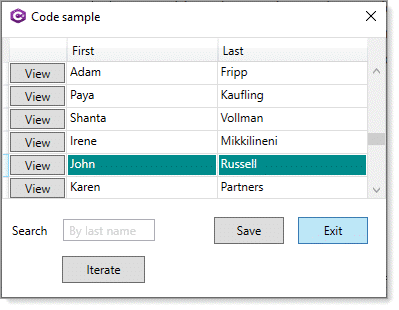
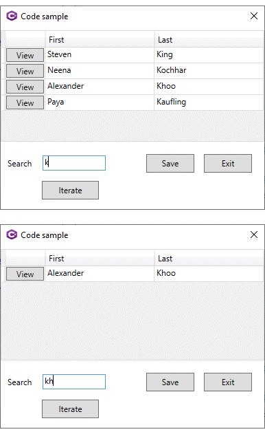

# About

In this part of the series synchronous operations for reading and saving are shown.

# See also
[WPF Apps With The Model-View-ViewModel Design Pattern](https://docs.microsoft.com/en-us/archive/msdn-magazine/2009/february/patterns-wpf-apps-with-the-model-view-viewmodel-design-pattern)

# Steps to run

- Run script.sql from SSMS (SQL-Server Management Studio) or insides of Visual Studio.
- Restored NuGet packages from Solution Explorer
- Build and run the project. 

**Part 1** [Microsoft TechNet article: WPF/Entity Framework Core primer (C#)](https://social.technet.microsoft.com/wiki/contents/articles/53914.wpfentity-framework-core-primer-c.aspx)

**Part 2** [Microsoft TechNet article: WPF/EF Core simple data validation (C#)](https://social.technet.microsoft.com/wiki/contents/articles/53915.wpfef-core-simple-data-validation-c.aspx)

 

